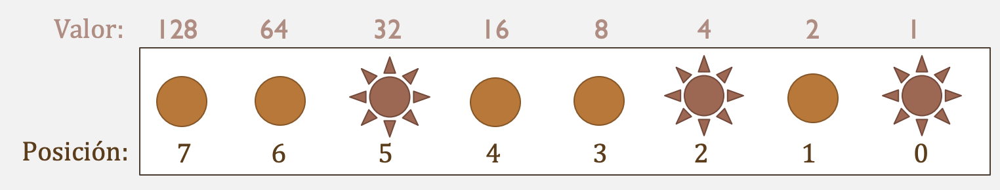

# Representación de enteros en memoria
La representación de enteros sin signo es una cadena binaria (compuesta de unos y ceros) tal que cada posición representa una potencia de 2.

## Refresh de binario
El binario, como los otros sistemas numéricos, se basa en el valor de las posiciones de los dígitos. En el caso del binario, cada posición representa una potencia de 2 en lugar de 10 como en el binario.

Podemos ver cada digito como un 1 o un 0, que nos indica si consideramos o no el valor de esa potencia de 2.


```txt
El 5 en binario es 101. Si leemos de izquierda a derecha, cada posición representa una potencia de 2, y el 1 y 0 nos indica si consideramos el valor de esa potencia o no.
La primera posición (la de más a la derecha) es 2^0, la segunda es 2^1, la tercera es 2^2 etc.

Para el 5, entonces:
- La primera posición es 2^0 = 1. Como tenemos un 1, agregamos 1 a la suma.
- La segunda posición es 2^1 = 2. Como tenemos un 0, no agregamos nada a la suma.
- La tercera posición es 2^2 = 4. Como tenemos un 1, agregamos 4 a la suma.

Ya no tenemos más posiciones, entonces la suma final nos queda:
1 + 0 + 4 = 5

```


## Complemento a 2
Para representar los enteros en C, usamos un método llamado complemento a 2. Esto nos permite representar tanto números positivos como negativos sin dedicar un bit **exclusivamente** a representar el signo.

Lo primero para el complemento a 2 es identificar el signo: El bit más significativo (el de más a la izquierda) nos dice si será positivo (si es 0) o negativo (si es 1).

### Si es positivo
Si el bit más significativo es 0 significa que es positivo. En este caso, la representación es "directa" del binario.

### Si es negativo
Si el bit más significativo es 1 significa que es negativo. En este caso, la representación es el complemento a 2 del binario y para saber el valor decimal representado hay que hacer lo siguiente:

1. Invertir todos los bits (cambiar 0 por 1 y 1 por 0)
2. Sumarle 1 al resultado de la inversión.

Entonces, nos queda un valor decimal y decimos que es negativo.

#### Ejemplos
**Representar -10 en binario de 8 bits:**

1) Identificamos que es negativo, entonces tenemos que hacer complemento a 2.

2) Representamos 10 en binario, en 8 bits:

    Ponemos nuestra tablita de posiciones, comenzando con el resultado todo en 0.

    | Posicion: | 7 | 6 | 5 | 4 | 3 | 2 | 1 | 0 |
    |-----------|---|---|---|---|---|---|---|---|
    | Valor:    | 128 | 64 | 32 | 16 | 8 | 4 | 2 | 1 |
    | Resultado (10 en binario): | 0 | 0 | 0 | 0 | 0 | 0 | 0 | 0 |

    El valor más grande de los de la tabla que es menor o igual a 10 es 8. Colocamos ese bit en **1** y le restamos 8 al 10, nos queda 2 por acomodar
    
    | Posicion: | 7 | 6 | 5 | 4 | 3 | 2 | 1 | 0 |
    |-----------|---|---|---|---|---|---|---|---|
    | Valor:    | 128 | 64 | 32 | 16 | 8 | 4 | 2 | 1 |
    | Resultado (10 en binario): | 0 | 0 | 0 | 0 | **1** | 0 | 0 | 0 |

    Repetimos con el 2:

    El valor más grande de los de la tabla que es menor o igual a 2 es 2. Colocamos ese bit en **1** y le restamos 2 al 2, nos queda 0 y entonces terminamos.

    | Posicion: | 7 | 6 | 5 | 4 | 3 | 2 | 1 | 0 |
    |-----------|---|---|---|---|---|---|---|---|
    | Valor:    | 128 | 64 | 32 | 16 | 8 | 4 | 2 | 1 |
    | Resultado (10 en binario): | 0 | 0 | 0 | 0 | 1 | 0 | **1** | 0 |


    10 en binario de 8 bits es `0b00001010`

    3) Ahora, complemento a 2, que es invertir y sumarle 1:

        1) Invertir todos los bits:
        ```
        original:  0b00001010
        invertido: 0b11110101
        ```

        2) Sumarle 1 al resultado de la inversión:
        ```
        invertido: 0b11110101
        + 1:       0b11110110
        ```

    4) Entonces, -10 en binario de 8 bits es `0b11110110` 

    **¿Y si fuera en 16 bits?**
    Repetimos todo, sólo que en lugar de usar 8 bits, usaremos 16 desde el principio.

    1. Primero tenemos que representar 10 en binario de 16 bits, nos queda:
    `0b0000000000001010` (llenamos con 0s a la izquierda.)

    2. Hacemos el complemento a 2:
    ```
    Invertido: 0b1111111111110101
    + 1:       0b1111111111110110
    ```

    Entonces, -10 en binario de 16 bits es `0b1111111111110110`

    ¿Notas que es igual que el de 8 bits, pero con 8 bits más a la izquierda y todos en 1?

Aquí una herramienta en línea para comprobar tus resultados: [Two's Complement Calculator](https://www.exploringbinary.com/twos-complement-converter/)

## Ejercicios
Escribe la cadena de bits que representa estos valores en C:

- `- 12` en 8 bits
- `18` en 16 bits
- `1234` en 32 bits
- `-1234` en 32 bits
- `-1` en 8 bits

¿Qué valores decimales representan estas cadenas de bits? Observa el tamaño en bits.
- `0b01101001` con signo y sin signo.
- `0b11001101` con signo y sin signo.
- `0xF03` con signo y sin signo.
- `0xFFFFFFFF` con signo.
