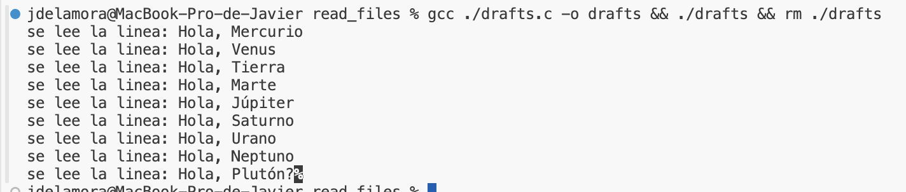

# Leer archivos en C
Además de proveer entrada a nuestro programa con la consola y con los argumentos del programa, podemos darle acceso a archivos.

Existen distintas librerías y funciones que nos permiten interactuar con archivos, pero lo básico es:
1. Abrir un archivo con los permisos necesarios.
2. Leer o escribir en el archivo.
3. Cerrar el archivo.

## Leer archivos con stdio.h
La librería `stdio.h` nos provee funciones para leer y escribir archivos.

### Abrir un archivo
Para abrir un archivo usamos la función `fopen` que recibe el nombre del archivo y el modo de apertura. Los modos de apertura son:
- `r`: de "read", abrir un archivo para lectura. Si no se encuentra el archivo, la función retorna `NULL`.
- `w`: de "write", abrir un archivo para escritura. Si el archivo no existe, se crea. Si el archivo existe, se sobreescribe.
- `a`: de "append", abrir un archivo para escritura. Si el archivo no existe, se crea. Si el archivo existe, se escribe al final.
- `r+`: de "read and write", abrir un archivo para lectura y escritura. El archivo debe existir, si no, la función retorna `NULL`.
- `w+`: de "write and read", abrir un archivo para lectura y escritura. Si el archivo no existe, se crea. Si el archivo existe, se sobreescribe.
- `a+`: de "append and read", abrir un archivo para lectura y escritura. Si el archivo no existe, se crea. Si el archivo existe, se escribe al final.

La función fopen regresa un puntero a un objeto de tipo `FILE`, que es un tipo de dato definido en `stdio.h`. Este puntero se usa en las llamadas de funciones para leer, escribir y cerrar el archivo.

Como vemos en los modos de apertura, es posible que se retorne `NULL` si no se puede abrir el archivo. `NULL` es un valor especial que puede asignarse a los apuntadores, que significa "no apunta a nada" y en el caso de `fopen` significa que no se pudo abrir el archivo.

```c
#include <stdio.h>

int main()
{
    // abrimos el archivo archivo.txt en modo lectura
    FILE *archivo = fopen("archivo.txt", "r");
    
    /*
    // podríamos usar una variable de tipo char[] para el nombre del archivo,
    // que venga por ejempolo del usuario o como argumento del programa

    char nombre_archivo[100];
    printf("Ingrese el nombre del archivo: ");
    scanf("%s", nombre_archivo);

    FILE *archivo = fopen(nombre_archivo, "r");
    */

    if (archivo == NULL) {
        printf("No se pudo abrir el archivo\n");
        return 1; // terminamos el programa haciendo return en la funcion main, y mandamos un valor distinto a 0 para indicar error.
    }

    return 0;
}
```

El nombre del archivo es un string, que indica la ubicación del archivo. Si el archivo está en la misma carpeta que el programa, basta con el nombre del archivo. Si está en una carpeta diferente, se debe especificar la ruta absoluta del archivo o la ruta relativa a la ubicación de ejecución del programa.

### Leer el contenido del archivo
Para leer el contenido de un archivo, podemos hacerlo caracter por caracter o línea por línea. El acercamiento depende de lo que queramos hacer con el archivo.

En ambos acercamientos vamos leyendo poco a poco y la función de lectura "avanza" en el archivo. Por ejemplo, si leemos un caracter, la próxima vez que leamos, leeremos el siguiente caracter. Esto continúa hasta que llegamos al final del archivo.

#### Leer caracter por caracter
Para leer el siguiente caracter del archivo usamos la función `fgetc` que recibe un puntero a un objeto de tipo `FILE` y regresa el siguiente caracter del archivo. Si llegamos al final del archivo, la función regresa el valor `EOF` que significa "End Of File".

Imagina un archivo "hola_mundo.txt" que tiene este contenido:
```txt
Hola, mundo!
```

Podemos leer todos los caracteres del archivo, uno a uno, con el siguiente código:
```c
#include <stdio.h>

int main()
{
    FILE *archivo = fopen("hola_mundo.txt", "r");

    if (archivo == NULL) {
        printf("No se pudo abrir el archivo\n");
        return 1;
    }

    // aqui guardaremos el caracter que vamos leyendo.
    char caracter;
    while ((caracter = fgetc(archivo)) != EOF) {
        printf("se lee el caracter con valor ascii (%d) '%c'\n", caracter, caracter);
    }

    fclose(archivo);
    return 0;
}
```

Algo interesante pasa en el while: observemos que dentro de los paréntesis del while estamos ejecutando la función de leer el caracter y lo estamos asignando a la variable caracter.

¡¡¡ Recordemos que el operador `=` regresa el valor asignado !!! esto es bastante útil para realizar comparaciones en if, while o for cuando hacemos una asignación de valores.

Otra forma de escribir ese while sería con un ciclo infinito que se rompe cuando encontramos el final del archivo.
```c
while (1) {
    caracter = fgetc(archivo);
    if (caracter == EOF) {
        break;
    }

    printf("se lee el caracter con valor ascii (%d) '%c'\n", caracter, caracter);
}
```

#### Leer linea por linea
Para leer la siguiente linea del archivo usamos la función `fgets` que recibe un puntero a un objeto de tipo `FILE`, un puntero a un arreglo de caracteres donde se guardará la línea leída y el tamaño máximo de la línea. La función regresa el puntero al arreglo de caracteres donde se guardó la línea leída.

Hay un par de diferencias importantes:
- no se regresa el valor leído, sino el puntero al arreglo donde se guardó.
- se lee una línea completa, hasta encontrar un salto de línea o el final del archivo y limitado al tamaño que se especifica.
- al encontrar el final del archivo, la función regresa `NULL` en lugar de 'EOF'.

Imagina un archivo "hola_planetas.txt" que tiene este contenido:
```txt
Hola, Mercurio
Hola, Venus
Hola, Tierra
Hola, Marte
Hola, Júpiter
Hola, Saturno
Hola, Urano
Hola, Neptuno
Hola, Plutón?
```

Podemos leer linea por linea con este código:
```c
#include <stdio.h>

int main()
{
    FILE *archivo = fopen("hola_planetas.txt", "r");

    if (archivo == NULL) {
        printf("No se pudo abrir el archivo\n");
        return 1;
    }

    // aqui guardaremos cada línea que se vaya leyendo.
    char linea[100];
    while (fgets(linea, 100, archivo) != NULL) {
        printf("se lee la linea: '%s'", linea);
    }

    fclose(archivo);
    return 0;
}
```

Ejecuta el codigo y observa que se lee cada línea del archivo, incluyendo el salto de línea al final de cada línea. La última linea no tiene salto de linea, por eso podrías observar el caracter extraño al final como en esta imagen:


Intenta agregar salto de línea al final para que veas la diferencia.

Ahora, si queremos guardar todas las líneas leídas tendríamos que declarar antes una variable en donde podamos ir guardando las líneas leídas.

Usemos un arreglo de arreglos de caracteres (un arreglo de strings) para guardar todas las líneas leídas, especificando un tamaño máximo para cada línea y un tamaño máximo para el total de líneas. Es necesario hacer esto por ahora porque no sabemos de manera anticipada cuántas líneas serán.

```c
#include <stdio.h>

int main()
{
    FILE *archivo = fopen("hola_planetas.txt", "r");

    if (archivo == NULL) {
        printf("No se pudo abrir el archivo\n");
        return 1;
    }

    // aqui guardaremos cada línea que se vaya leyendo.
    char lineas[10][100]; // 10 lineas de 100 caracteres
    int i = 0;

    // ahora, al fgets le mandamos la linea que sigue en nuestro arreglo, comenzando la lectura desde la posición i
    // y se irá guardando ahí el contenido.
    while (fgets(lineas[i], 100, archivo) != NULL) {
        i++;

        if (i == 10) {
            printf("Se llegó al límite de lineas\n");
            break;
        }
    }

    // recuerda siempre cerrar el archivo
    fclose(archivo);

    // ahora imprimimos las lineas leídas
    // i tiene guardado el ultimo valor antes de salir del while, que es el numero de lineas leidas
    for (int j = 0; j < i; j++) {
        printf("se lee la linea: '%s'", lineas[j]);
    }

    return 0;
}
```

Si quisiéramos leer siempre todas las líneas, ¡Podríamos leer dos veces el archivo! una para contar las lineas y la línea más larga, luego para ver el contenido... por ahora usemos máximos, si quieren explorar la otra opción, adelante.

### Escribir en un archivo
Para escribir en un archivo, usamos la función `fputc` para escribir un caracter y la función `fputs` para escribir una cadena de caracteres.

#### Escribir caracter por caracter
Para escribir un caracter en un archivo usamos la función `fputc` que recibe el caracter a escribir y un puntero a un objeto de tipo `FILE`. La función regresa el caracter escrito o `EOF` si hubo un error.

Imagina que queremos escribir "Hola, mundo de los archivos!" en un archivo "saludo.txt":
```c
#include <stdio.h>

int main()
{
    // abrimos el archivo
    // si no existe, lo creamos
    // si existe, lo sobreescribimos
    FILE *archivo = fopen("saludo.txt", "w");

    if (archivo == NULL) {
        printf("No se pudo abrir el archivo\n");
        return 1;
    }

    // escribimos caracter por caracter
    fputc('H', archivo);
    fputc('o', archivo);
    fputc('l', archivo);
    fputc('a', archivo);
    fputc(',', archivo);
    fputc(' ', archivo);
    fputc('m', archivo);
    fputc('u', archivo);
    fputc('n', archivo);
    fputc('d', archivo);
    fputc('o', archivo);
    fputc(' ', archivo);
    fputc('d', archivo);
    fputc('e', archivo);
    fputc(' ', archivo);
    fputc('l', archivo);
    fputc('o', archivo);
    fputc('s', archivo);
    fputc(' ', archivo);
    fputc('a', archivo);
    fputc('r', archivo);
    fputc('c', archivo);
    fputc('h', archivo);
    fputc('i', archivo);
    fputc('v', archivo);
    fputc('o', archivo);
    fputc('s', archivo);
    fputc('!', archivo);

    fclose(archivo);
    return 0;
}
```

#### Escribir cadena de caracteres
Para escribir una cadena de caracteres en un archivo usamos la función `fputs` que recibe un puntero a un arreglo de caracteres y un puntero a un objeto de tipo `FILE`. La función regresa `EOF` si hubo un error.

Usemos la opcion "a" para que no sobreescriba el archivo, sino que agregue al final. Agregaremos una despedida al archivo "saludo.txt":

```c
#include <stdio.h>

int main()
{
    // abrimos el archivo
    // si no existe, lo creamos
    // si existe, agregamos al final
    FILE *archivo = fopen("saludo.txt", "a");

    if (archivo == NULL) {
        printf("No se pudo abrir el archivo\n");
        return 1;
    }

    // escribimos una cadena de caracteres
    fputs("Adios, mundo de los archivos!\n", archivo);

    fclose(archivo);
    return 0;
}
```

Abre el archivo y observa cómo el contenido es una sola línea: `Hola, mundo de los archivos!Adios, mundo de los archivos!`. Modifica este segundo programa para que el archivo tenga dos líneas, una con el saludo y otra con la despedida.

### Cerrar un archivo
Para cerrar un archivo usamos la función `fclose` que recibe un puntero a un objeto de tipo `FILE`. La función regresa `0` si se cerró correctamente y `EOF` si hubo un error.

Es importante cerrar los archivos luego de usarlos porque podríamos ocasionar problemas como "bloquear" el archivo, perder los cambios realizados, utilizar recursos del sistema de forma innecesaria, entre otros.

```c
#include <stdio.h>

int main()
{
    FILE *archivo = fopen("saludo.txt", "a");

    if (archivo == NULL) {
        printf("No se pudo abrir el archivo\n");
        return 1;
    }

    fputs("Adios, mundo de los archivos!\n", archivo);

    // cerramos el archivo
    if (fclose(archivo) == EOF) {
        printf("No se pudo cerrar el archivo\n");
        return 1;
    }

    return 0;
}
```
