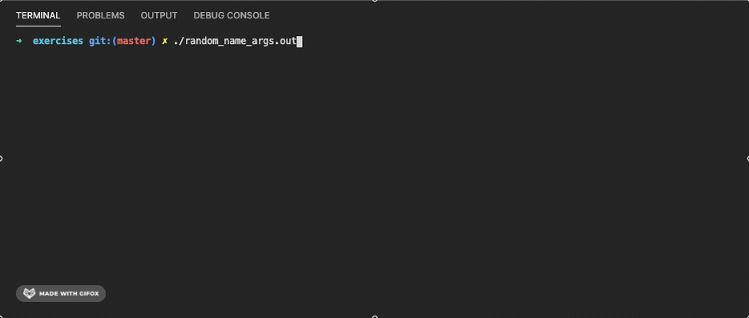

# Argumentos del programa
Hasta ahora, hemos trabajado nuestros programas con una función main que regresa un entero y no recibe parámetros, muy parecida a esta:
```c
int main()
{
   // do some stuff
   
   return 0;
}
```

Hoy conoceremos cómo enviar parámetros de ejecución a nuestro programa desde la línea de comandos.

## Pasarle argumentos a un programa
Pasarle argumentos a un programa es algo que hemos estado haciendo durante todo el semestre, cuando compilamos desde la consola:
```shell
gcc main.c -o main.exe -Wall
```
- Ejecutamos el programa `gcc`
- Le pasamos un argumento `main.c`, que el programa interpreta como "este es el archivo fuente a compilar"
- Le pasamos un argumento `-o`, que el programa interpreta como "el siguiente argumento es el nombre que le tengo que poner al compilado!"
- Le pasamos un argumento `main.exe`, que el programa interpreta como el nombre del compilado que generará (porque el anterior es `-o`)
- Le pasamos un argumento `-Wall`, que el programa interpreta como "imprime en la consola todos los warnings que te encuentres al compilar"

Si ejecutamos el programa `gcc` sin especificarle argumentos, obtendremos un mensaje de error:
```shell
$ gcc
clang: error: no input files
```

El programa `gcc` está diseñado para:
- Recibir uno o más argumentos al ser ejecutado.
- Validar los argumentos que recibe, y dar mensajes de error si no son correctos.
- Comportarse de forma distinta cada vez que se ejecuta, dependiendo de los argumentos.

Nosotros podemos lograr esto también para nuestros programas, modificando la función main.

## La función main con argumentos
Existe una forma alternativa de declarar la función main en un programa, que nos permite recibir parámetros al ejecutar; probablemente la has encontrado en algún tutorial en línea o declarada así al comenzar un proyecto en tu IDE.
```c
int main(int argc, char *argv[])
{
    // validate arguments
    
    // do some stuff
    
    return 0;
}
```
¿Qué son esos dos argumentos que agregamos a la función main?
- `int argc`: es corto de "argument count", e indica el número de argumentos que recibió la función main.
- `char *argv[]`: es corto de "argument values", y es una lista de strings que contiene los valores, en strings, de los argumentos con los que se ejecutó el programa.

ℹ️ La forma en que se expresó el arreglo de strings (`char *argv[]`) es distinta a lo que has estado utilizando (`char listaDeStrings[][20]`); es algo que conocerás en la siguiente materia _Programación con memoria dinámica_, cuando conozcas los apuntadores.

### argc y argv
Agregando los argumentos `argc` y `argv` a nuestro programa podemos recibir argumentos al ejecutar nuestro programa. Exploremos con un código ejemplo cómo se comportan estos argumentos al ejecutarse.

1. Lee [el código](tutorial_program_args.c) y trata de entenderlo.

2. Compila el programa, usando esta linea.

```shell   
gcc tutorial_program_args.c -o tutorial-args.exe -Wall
```
Si estás usando REPLIT también puedes compilar programas de esta forma, solo tienes que cambiar el argumento para que el nombre sea main.c:
```shell   
gcc main.c -o tutorial-args.exe -Wall
```


3. Ejecútalo con estos argumentos, y observa el mensaje que obtienes en cada caso.

```shell
./tutorial-args.exe
```

```shell
./tutorial-args.exe hola
```

```shell
./tutorial-args.exe dos argumentos
```

```shell
./tutorial-args.exe le pasamos mas de dos argumentos
```

#### Pasarle un string con espacios
Normalmente los argumentos se separan por espacios, pero si queremos pasarle un string con espacios, debemos encerrarlo entre comillas dobles.

```shell
./tutorial-args.exe "hola mundo"
```

# Ejercicio: programa que suma N numeros
Crea un programa que, al ser ejecutado, reciba una cantidad de números del usuario e imprima la suma de todos ellos.

- Que el programa pueda recibir numeros enteros o flotantes (tip: ver las funciones [atoi](https://www.tutorialspoint.com/c_standard_library/c_function_atoi.htm) y [atof](https://www.tutorialspoint.com/c_standard_library/c_function_atof.htm))
- Si alguno de los argumentos no es un numero (e.g. `sumar 10 200 hola`), que el programa imprima un numero de error.

Ejemplo de uso:


# Ejercicio Nombre aleatorio desde argumentos
Este ejercicio tiene mucho parecido con el ejercicio de strings: [nombre aleatorio](/lessons/strings), pero modificarás algunas cosas para recibir la lista de nombres como argumentos al ejecutar el programa.

Esto nos restringe, claro, a solo usar una palabra por nombre.

## Problema
Queremos un programa al que le podamos pasar una lista de nombres, de una sola palabra cada uno, y nos imprima en la consola uno de ellos de forma aleatoria.

- Si no se indica ningún nombre, se debe mostrar un mensaje de error.
– Queremos que cada ejecución sea un nombre aleatorio.

Al final tu programa se comportará de esta forma:


