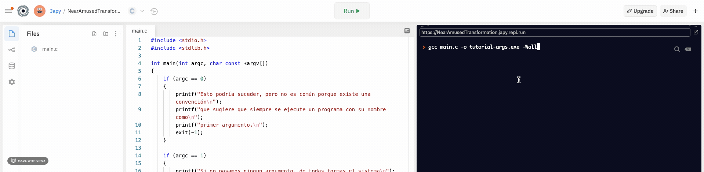

# Argumentos del programa
El código de este tutorial puede ayudarte a entender mejor cómo se reciben los argumentos del main
y cómo puedes usarlos.

## Tutorial:
1. Lee [el código](tutorial_program_args.c) y trata de entenderlo.

2. Compila el programa, usando esta linea.

```shell   
gcc tutorial_program_args.c -o tutorial-args.exe -Wall
```
Si estás usando REPLIT también puedes compilar programas de esta forma, solo tienes que cambiar el argumento para que el nombre sea main.c:
```shell   
gcc main.c -o tutorial-args.exe -Wall
```


3. Ejecútalo con estos argumentos, y observa el mensaje que obtienes en cada caso.

```shell
./tutorial-args.exe
```

```shell
./tutorial-args.exe hola
```

```shell
./tutorial-args.exe dos argumentos
```

```shell
./tutorial-args.exe le pasamos mas de dos argumentos
```

## Ejercicio [Nombre aleatorio desde argumentos]()
En este ejercicio, te basarás en algunas de las cosas del ejercico 5 de la lección de strings, pero modificarás algunas cosas para recibir la lista de nombres como argumentos al ejecutar el programa.

Esto nos restringe, claro, a solo usar una palabra por nombre.

Al final tu programa se comportará de esta forma:

