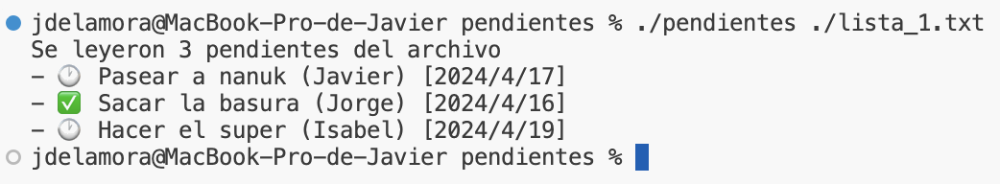
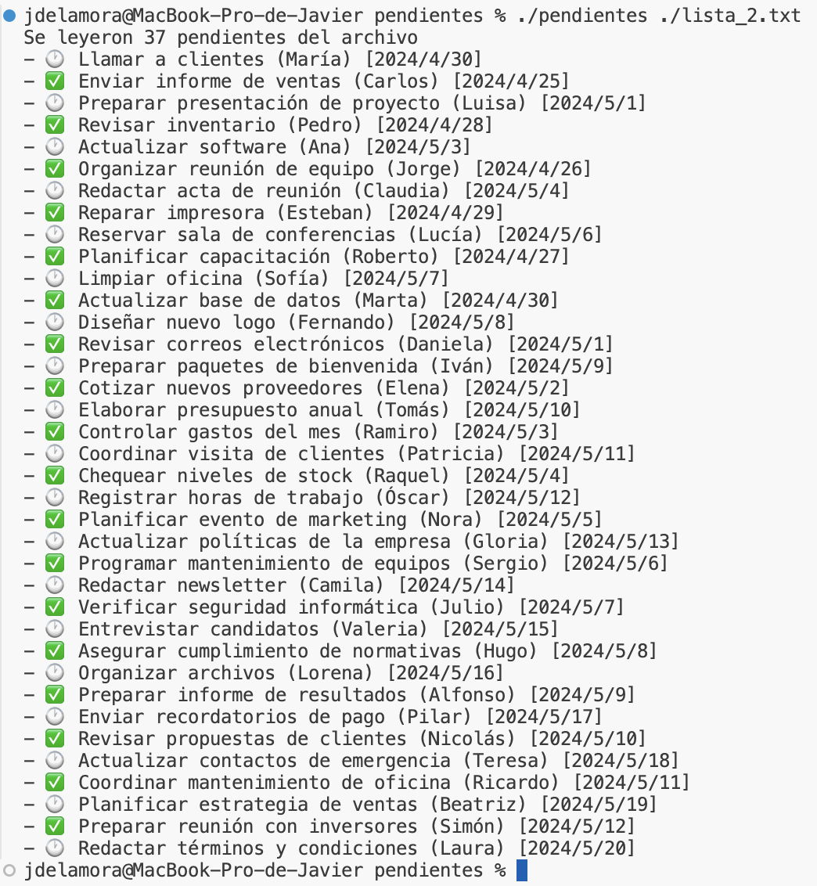

# Listas de Pendientes en Archivos
Tenemos unos archivos con listas de pendientes, y queremos un programa que pueda leerlos y mostrarlos en la pantalla.

El usuario ejecuta el archivo indicando el nombre del archivo a leer, y el programa muestra en la pantalla los pendientes que están en el archivo.

## Ejemplos de funcionamiento
### Ejemplo 1


### Ejemplo 2


### Ejemplo 3


## Definicion de datos
El programa maneja un tipo de dato `Pendiente` que tiene los siguientes campos:
- **Titulo**: es un texto de hasta 50 caracteres. Por ejemplo `Pasear a Nanuk`.
- **Encargado**: es el nombre de la persona encargada, de hasta 20 caracteres. Por ejemplo `Jorge`.
- **Fecha de Entrega**: es la fecha en la que debe completarse la tarea. Está guardado en otro tipo de dato `Fecha`, que contiene los campos `anio`, `mes` y `dia`.
- **Estatus**: es un campo que puede tener los valores PENDIENTE o COMPLETADO (una enumeracion).

## Formato del archivo
El archivo es un archivo de texto, que tiene la información de todos los pendientes de la lista.

- La primera linea es un número entero que indica la cantidad de pendientes en la lista.
- Luego, por cada pendiente hay 4 lineas:
  - La primera linea es el titulo del pendiente.
  - La segunda linea es el nombre del encargado.
  - La tercera linea es la fecha de entrega, en el formato `anio/mes/dia`.
  - La cuarta linea es el estatus del pendiente, un texto que puede ser `pendiente` o `completado`.
- Siempre hay `4n+1` lineas en el archivo, donde `n` es la cantidad de pendientes.
- La cantidad máxima de pendientes es 100.

**Ejemplo de archivo**:
```txt
3
Pasear a nanuk
Javier
2024/04/17
pendiente
Sacar la basura
Jorge
2024/04/16
completado
Hacer el super
Isabel
2024/04/19
pendiente
```

## Especificaciones
- Declara los tipos de dato struct y enum necesarios para representar los datos.
- Implementa una función `void imprimir_pendiente(Pendiente pendiente)` que recibe un pendiente y lo imprime en la pantalla.
- Implementa una función `void imprimir_lista_de_pendientes(Pendiente pendientes[], int cantidad)` que recibe un arreglo de pendientes y la cantidad de pendientes, e imprime todos los pendientes en la pantalla.
- Implementa una función `void imprimir_fecha(Fecha fecha)` que recibe una fecha y la imprime en la pantalla.
- Implementa una función `int leer_archivo_de_pendientes(char* nombre_archivo, Pendiente pendientes[])` que recibe el nombre de un archivo y un arreglo de pendientes donde se guardarán los pendientes leídos. La función lee el archivo y guarda los pendientes en el arreglo, y devuelve la cantidad de pendientes leidos.
- En la función `main` se declara un arreglo de pendientes y éste es el que se pasa a la función `leer_archivo_de_pendientes`. Luego se llama a la función `imprimir_lista_de_pendientes` para mostrar los pendientes en la pantalla.
- En la función `main` se recibe el nombre del archivo a leer como argumento del programa. Si no se recibe el argumento, se imprime un mensaje de error y se sale del programa con codigo distinto a `0`.
